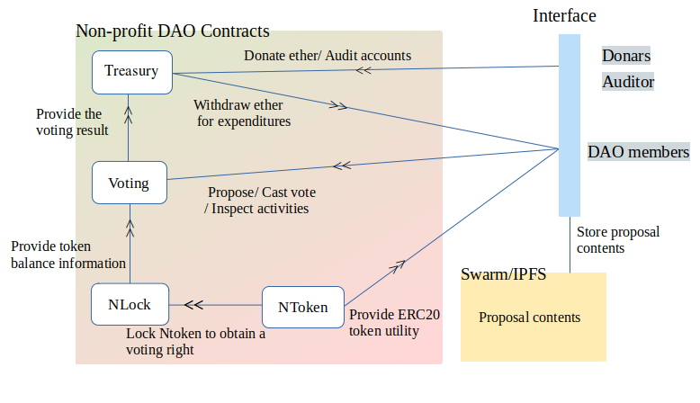

# Non-profit DAO (On-chain governance DAO for social goods.)<br>


## Contracts
### NToken
- DAO governance token<br>
- `NToken` has compatibility with other ERC20 tokens.<br>
```
Q:What is the purpose of the token?
If the token has economic value, the token holder is expected to act based on economic rationale. As a result, the holder contributes to DAO's growth.
```
### NLock
- Ntoken holders can receive `NLocked token` by locking their `Ntoken` on this contract.<br>
- `NLocked token` amount equals the token holder's voting power.
Voting power is calculated by `Ntoken amount * lock time / 1 year`.(This idea is inspired by the governance system of Curve.fi)
Once NToken is locked on this contract, it is not released until unlock time.
```
Q:What is the purpose of Locking?

```

- `Nlocked token` doesn't have compatibility with other ERC20 tokens.<br>
  Token holder can not transfer.

#### State variable
- `_name`
- `_symbol`
- `_decimal`
- `_totalSupply`
- `_nToken`
- `_lockedBalances `

#### Functions
- `name()`
- `symbol()`
- `decimal()`
- `totalSupply()`
- `createLock()`
- `withdraw()`
- `balanceOf()`

### NVoting
- This contract controls the voting system for this non-profit DAO.
- DAO members can propose and vote by using `Nlocked token`.<br>
- A result of the voting is not opened to the public until the voting period ends.
#### State variable
- `_name`
- `_proposalCount`
- `_minVotingPeriod`
- `_proposalList`
#### Functions
- `name()`
- `proposalCount()`
- `minVotingPeriod()`
- `createProposal()`
- `getProposal()`
- `getProposalVotes()`
- `getStatus()`
- `cancelProposal()`
- `castVote()`
### NTreasury
- The main role of this contract is to keep an accounts of DAO's incoming and outgoing with their information.(ex: donation, paying, expenditure, etc)
#### State variable
- `_records`
- `_recordCnt`
- `_totalFunds`
#### Functions
- `receive()`
- `getTotalFunds()`
- `getRecordCnt()`
- `_append()`
- `send()`
- `getTxRecord()`


## TODO
- add voting system(to reduce wasted votes)
- optimize uint data type (currently all uint is defied as uint256)
- add more test code
- delegate system(Quadratic Voting??)
- give a voting result to NTreasury contract
